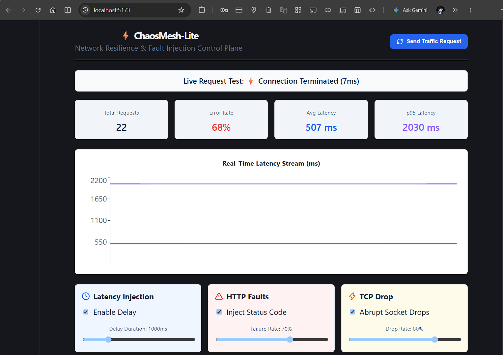
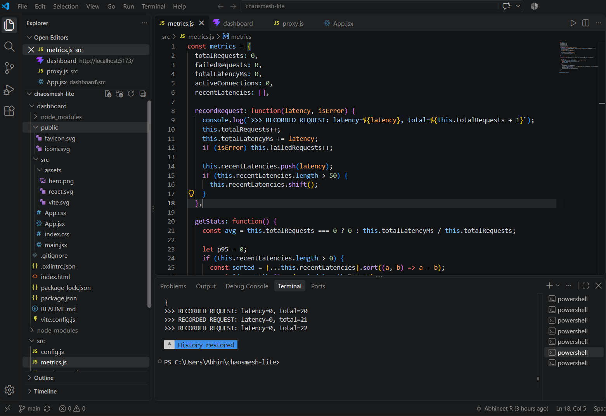

# ⚡ ChaosMesh-Lite

A lightweight, real-time chaos engineering and network resilience proxy built from scratch with Node.js and React.

### Telemetry & Interception Pipeline


ChaosMesh-Lite sits between clients and upstream microservices, allowing engineers to dynamically inject configurable latency, artificial HTTP failure rates, and abrupt TCP socket terminations without altering upstream application code.

---

## 🏗️ System Architecture

```text
               +---------------------------+
               |  React / Vite Dashboard   |
               |     (Control Plane)       |
               +-------------+-------------+
                             |
             [REST Config]   |   [WebSocket Telemetry]
                             v
               +---------------------------+
  Client Traffic ===>  ChaosMesh Proxy     |
               |     (Node.js / Express)   |
               +-------------+-------------+
                             |
                     (Reverse Proxy)
                             v
               +---------------------------+
               |  Upstream Microservice    |
               |       (Port 3000)         |
               +---------------------------+

✨ Features
Dynamic Latency Injection: Simulates network congestion with user-defined delay buffers and jitter offsets.

HTTP Fault Injection: Configurable synthetic error rates (e.g., 500 Internal Server Error) to validate client resilience and error boundaries.

TCP Socket Drops: Forcefully tears down client sockets via req.socket.destroy() to emulate sudden network partitions and container terminations.

Live Observability Engine: Computes request volume, error rates, rolling average latency, and p95 latency percentiles over sliding windows.

Real-Time Control Plane: WebSocket-based streaming metrics push updates to an interactive React dashboard every 500ms.

🛠️ Tech Stack
Backend / Core Engine: Node.js, Express, http-proxy, ws (WebSockets)

Frontend / Control Plane: React 18, Vite, Recharts, Lucide React

Dev Tools: Nodemon, ESLint

## 🎥 Live Demo Section
### Demo #1

https://github.com/user-attachments/assets/fd83ee4f-1f4a-47f5-8652-5987f5c1c3f0

### Demo #2

https://github.com/user-attachments/assets/c2c7b133-5459-420b-93e3-b8f1bdf3f617

## 🚀 Getting Started
Prerequisites
Node.js (v18+ recommended)
npm

